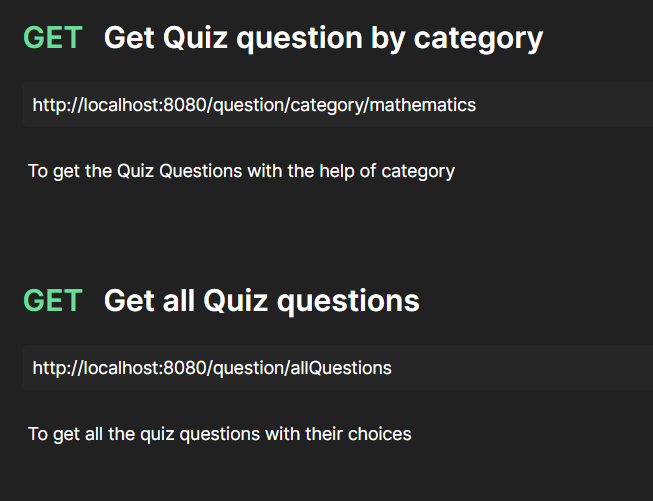

### Quiz Application Backend Using Java Spring Boot and Spring Data JPA

> Our quiz application backend is built using Java Spring Boot and leverages the power of Spring Data JPA for seamless interaction with the underlying database. This robust and scalable backend solution provides the necessary functionality to create, manage, and deliver quizzes to users.

## Key feature

-  **Quiz management** : The backend allows to create and manage quizzes . Each quiz can consist of multiple questions with options and correct answers. Quizzes can be categorized and organized for easy navigation.

-  **Quiz delivery** : Once a quiz is created, it can be made available for the users(clients) and scores are calculated automatically.

-  **Result tracking** : The backend maintain the quiz results and allow users to review their results

-  **Scalability and Performance** :  The Java Spring Boot framework, combined with the efficient querying capabilities of Spring Data JPA, ensures excellent performance and scalability. 

> Our Java Spring Boot backend, powered by Spring Data JPA, provides a reliable and efficient foundation for your quiz application. Its modular and extensible architecture enables future enhancements and integrations, ensuring the flexibility to meet your evolving requirements.

### Post Request

### Get Request

### Delete Request

### Post and Get Request in [Quiz middleware]

